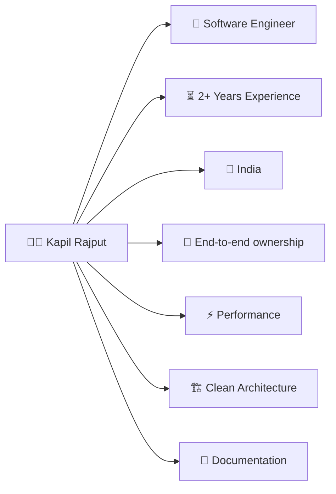
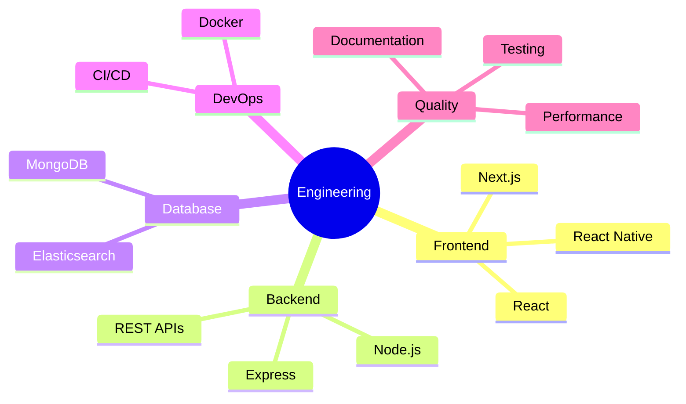
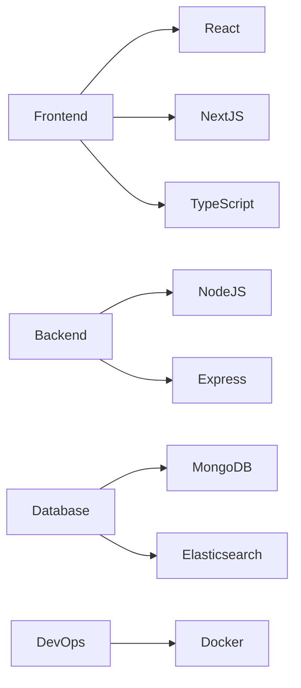
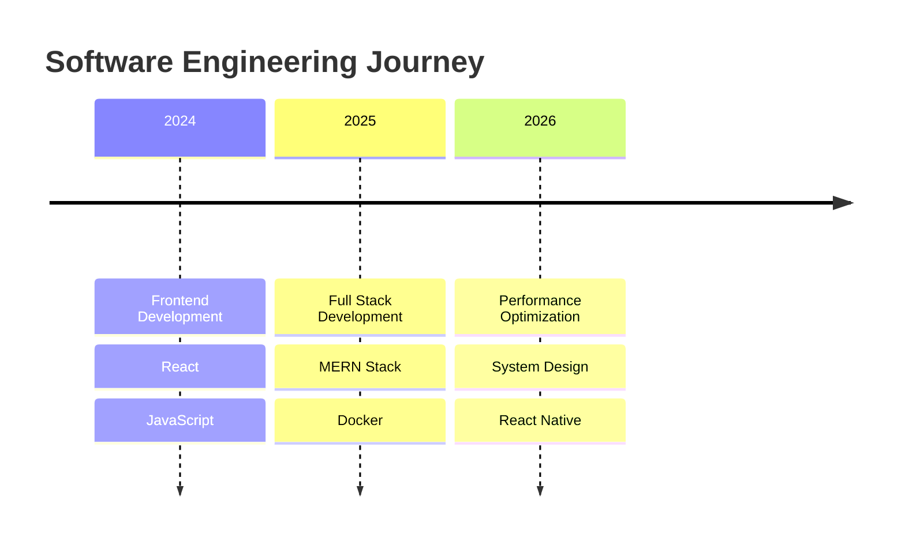
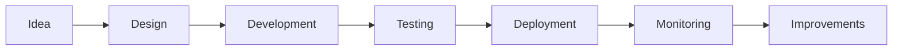

# Kapil Rajput

> Full Stack Software Engineer passionate about building scalable applications with modern web technologies.

---

## 👨‍💻 Profile

---

## 🚀 Engineering Focus

---

## 🛠 Tech Stack

---

## 📈 Experience Journey

---

## 💡 Core Strengths

- ⚡ Performance Optimization
- 📦 Clean Architecture
- 📱 Responsive UI
- 🔥 Developer Experience
- 📖 Documentation
- 🚀 Product Ownership

---

## 🎯 Current Interests

- React Native
- Next.js
- Docker
- Elasticsearch
- System Design
- Clean Architecture

---

## 📊 Workflow

---

## ❤️ Philosophy

> Write code that your teammates can understand six months later.

> Simplicity scales better than complexity.

> Documentation is part of the product.
