# 🚀 From Idea to Production

> Every successful product follows a structured engineering journey.

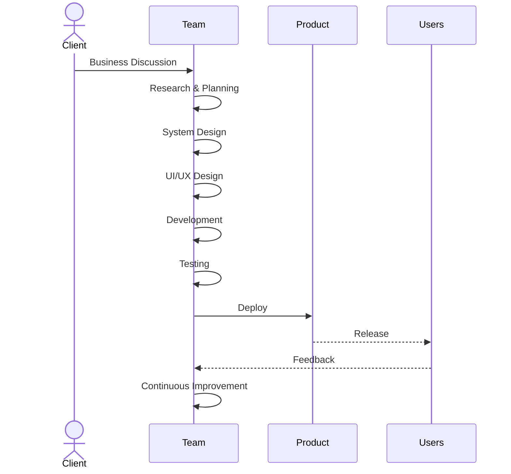

---

# 💡 Business Discovery

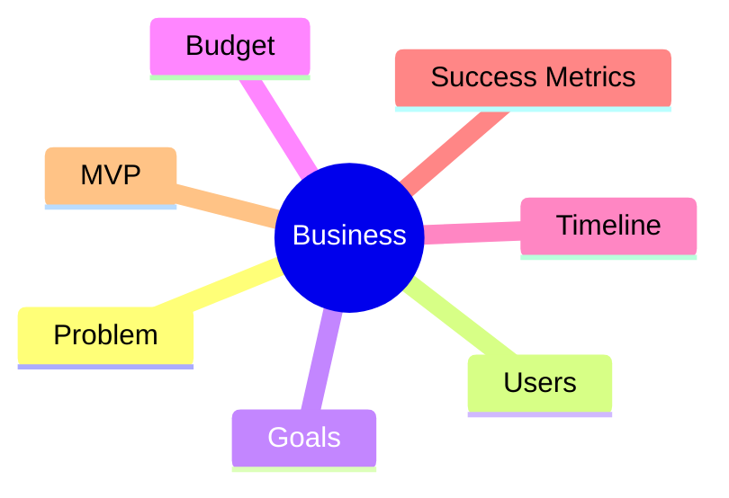

---

# 🔍 Product Research

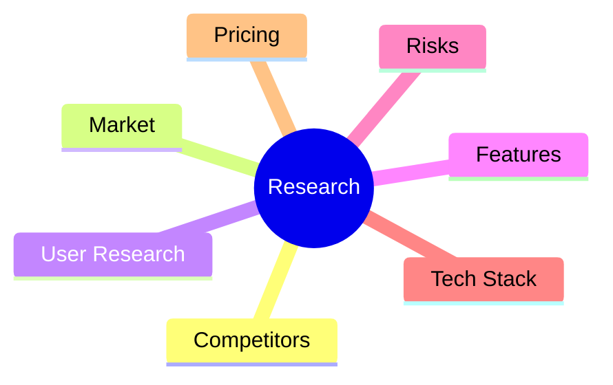

---

# 🏗️ Engineering Design

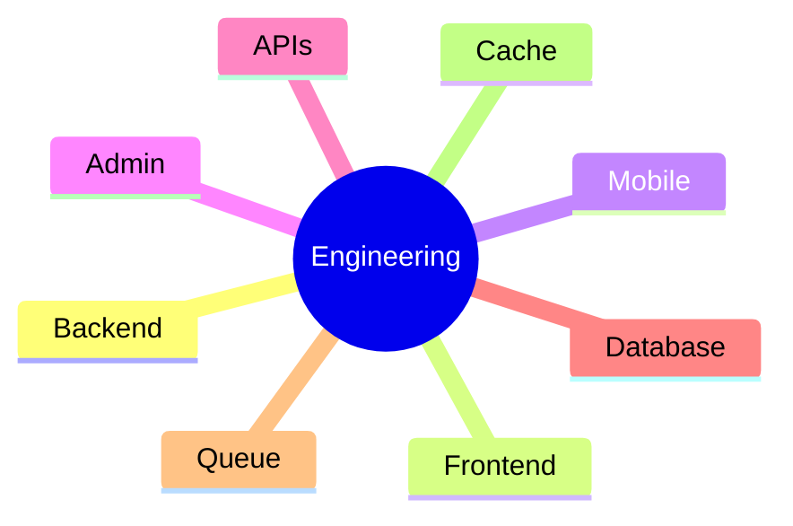

---

# 🗄️ Database

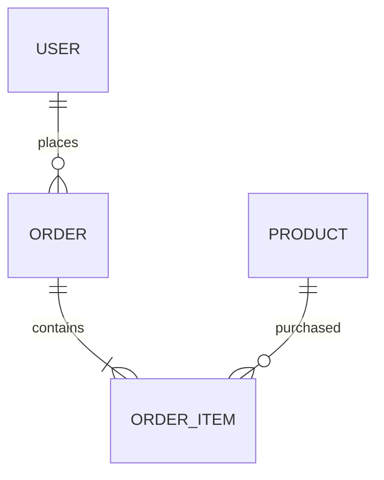

---

# 🔌 API Lifecycle

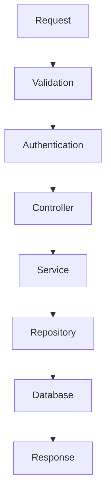

---

# 📁 Project Structure

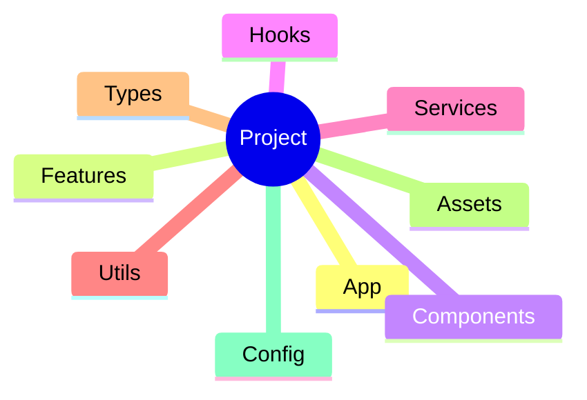

---

# 🧪 Quality Assurance

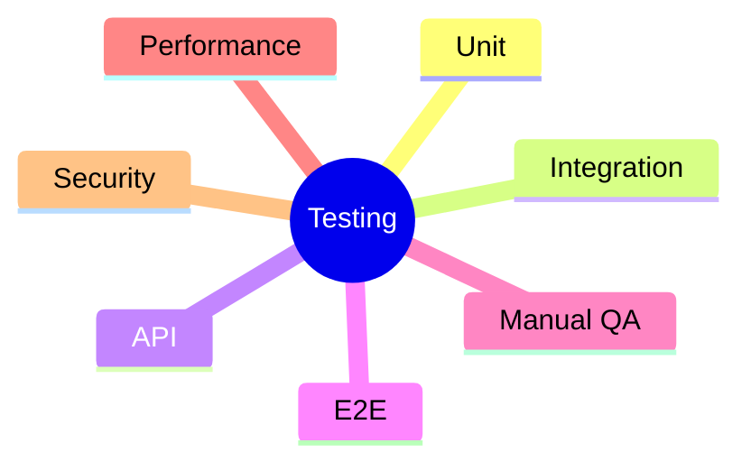

# 🔒 Security

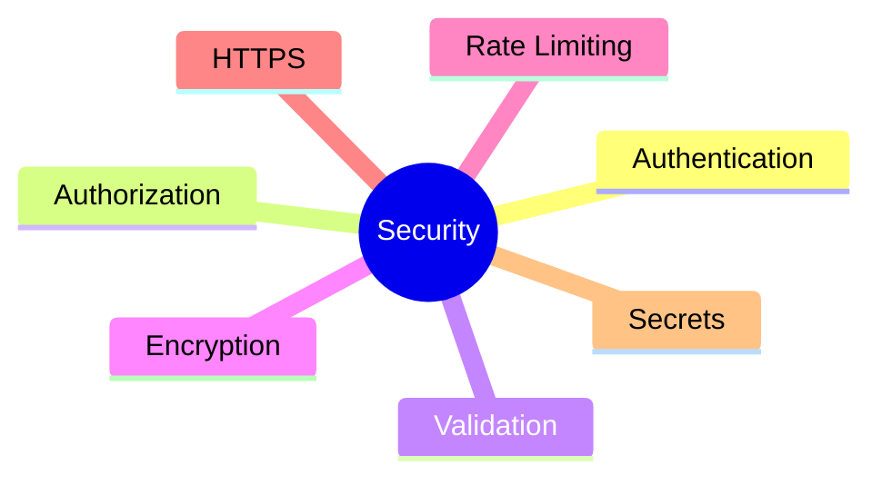

---

# 🚀 Deployment

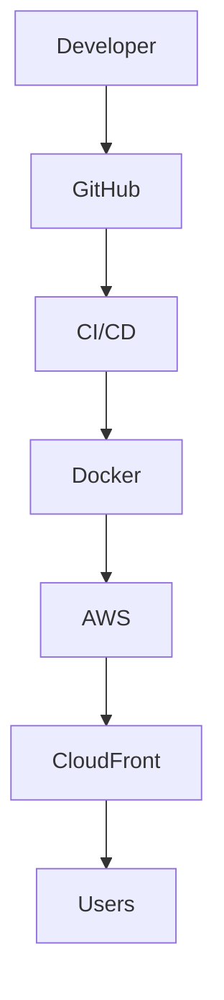

---

# 🧠 Engineering Principles

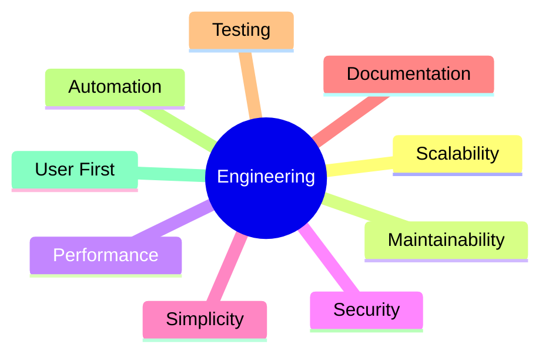
