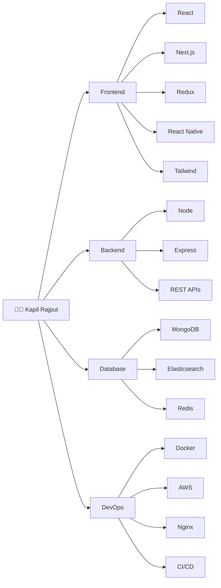
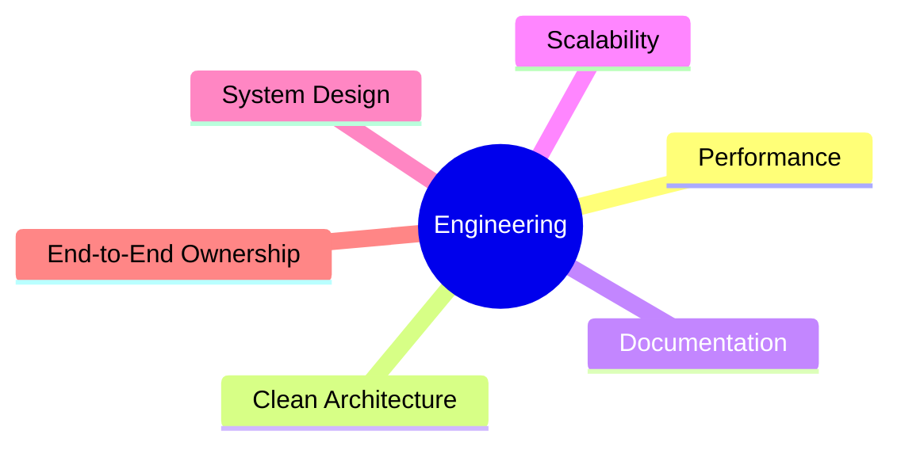
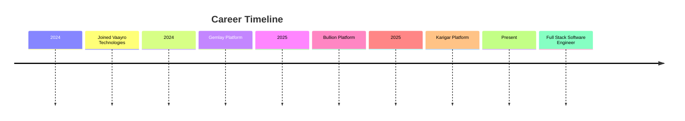
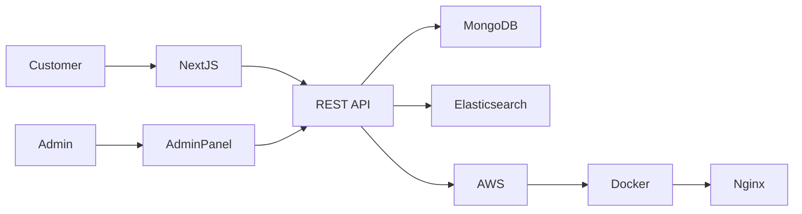
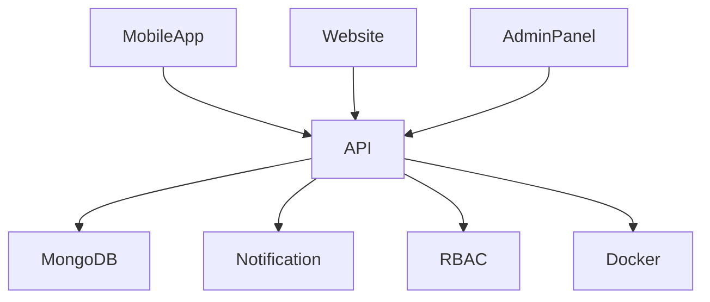
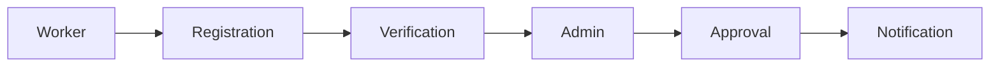
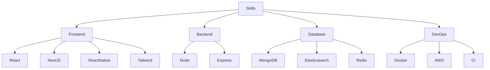
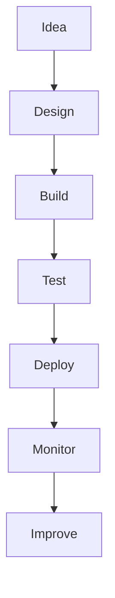
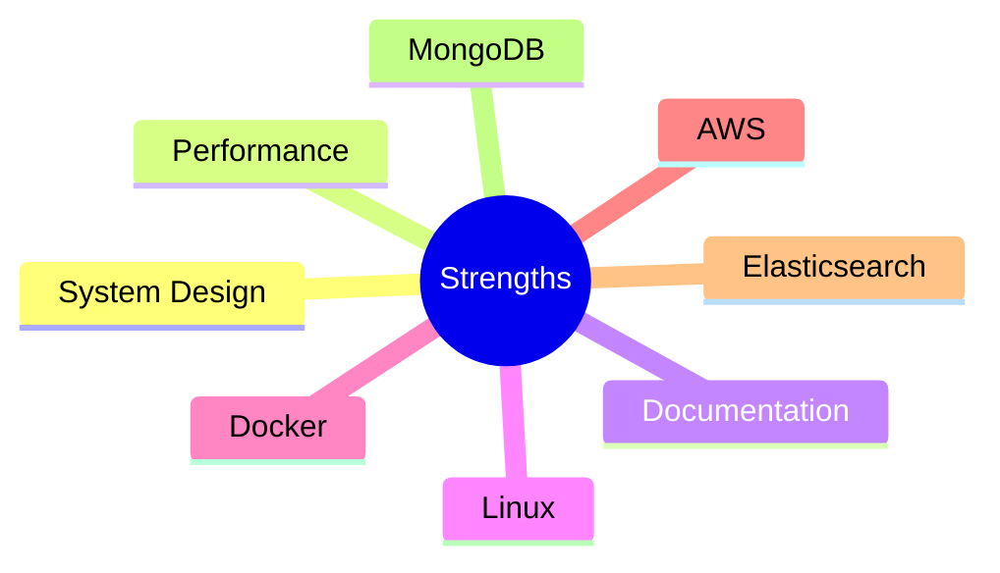

# 👨‍💻 Kapil Rajput

> Software Engineer • Full Stack • MERN • React Native

---

## Engineering Overview

---

# Professional Summary

Software Engineer with **2+ years** of experience building production-scale applications across **E-commerce**, **Marketplace**, and **Bullion Management** platforms.

## Core Focus

---

# Experience

---

## 💼 Vaayro Technologies

**Role**

Software Engineer

**Duration**

2 Years

---

### Gemlay

### Responsibilities

- Production Jewellery Platform
- SEO Optimized Next.js
- Elasticsearch Search
- REST APIs
- Admin Panel
- MongoDB Optimization
- AWS Deployment
- Docker
- Documentation

---

### Bullion Management

Responsibilities

- Admin Panel
- Mobile App
- REST APIs
- Real-time Updates
- RBAC
- Docker Deployment

---

### Karigar

Responsibilities

- Registration Workflow
- Approval Flow
- Notifications
- Mobile App
- Backend APIs

---

# Technical Skills

---

## Frontend

- React
- Next.js
- Redux
- React Native
- Tailwind CSS

---

## Backend

- Node.js
- Express
- REST APIs

---

## Database

- MongoDB
- Elasticsearch
- Redis

---

## DevOps

- Docker
- AWS
- Nginx
- CI/CD

---

## Languages

- JavaScript
- TypeScript

---

# Engineering Philosophy

---

# Education

**B.Tech**

Mechanical Engineering

Meerut Institute of Technology

---

# Strengths

---

# Contact

- 📍 Bijnor, Uttar Pradesh
- 📧 kapil.rajput9711@gmail.com
- 💼 LinkedIn
- 🐙 GitHub
- 🌐 Portfolio
