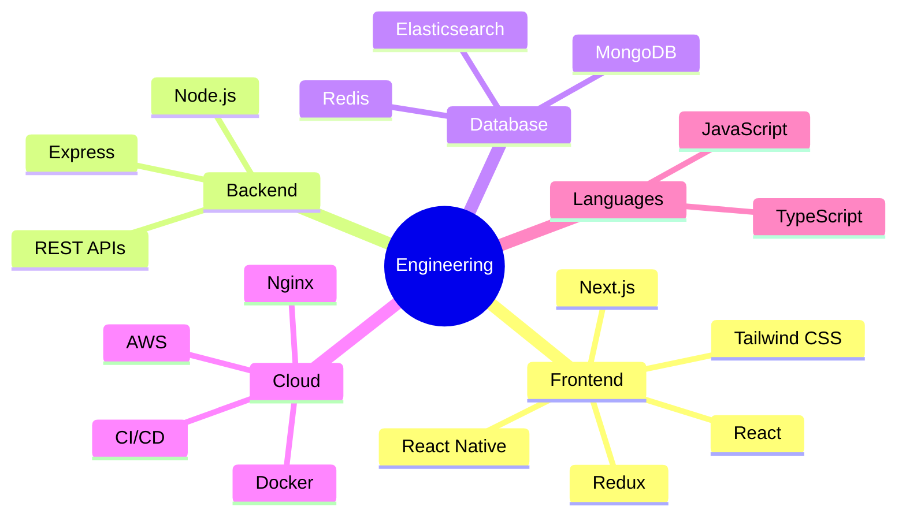
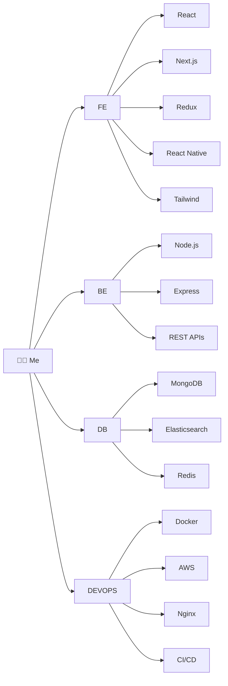

# 🛠️ Technical Skills

## Overview

```mermaid
mindmap
  root((Engineering))
    Frontend
      React
      Next.js
      Redux
      React Native
      Tailwind CSS
    Backend
      Node.js
      Express
      REST APIs
    Database
      MongoDB
      Elasticsearch
      Redis
    Cloud
      Docker
      AWS
      Nginx
      CI/CD
    Languages
      JavaScript
      TypeScript
```

---

## Architecture

```mermaid
flowchart LR

A["👨‍💻 Me"]

A --> FE
A --> BE
A --> DB
A --> DEVOPS

FE --> React
FE --> Next["Next.js"]
FE --> Redux
FE --> RN["React Native"]
FE --> Tailwind

BE --> Node["Node.js"]
BE --> Express
BE --> REST["REST APIs"]

DB --> MongoDB
DB --> Elasticsearch
DB --> Redis

DEVOPS --> Docker
DEVOPS --> AWS
DEVOPS --> Nginx
DEVOPS --> CICD["CI/CD"]
```
