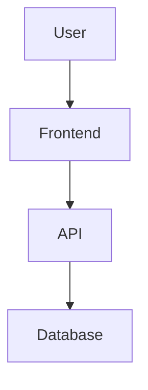
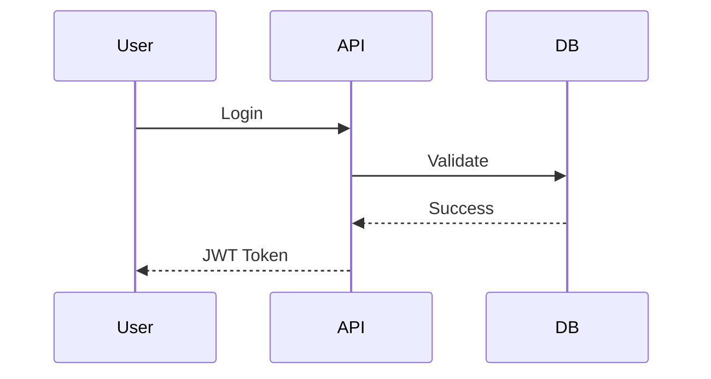
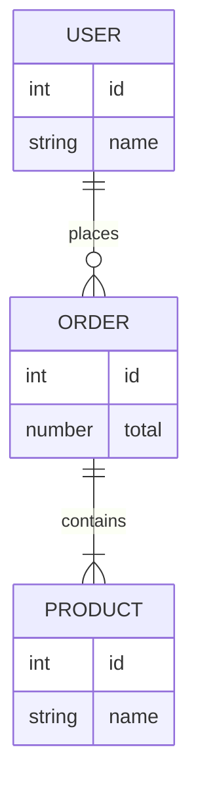
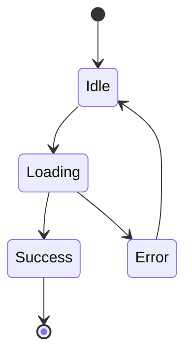
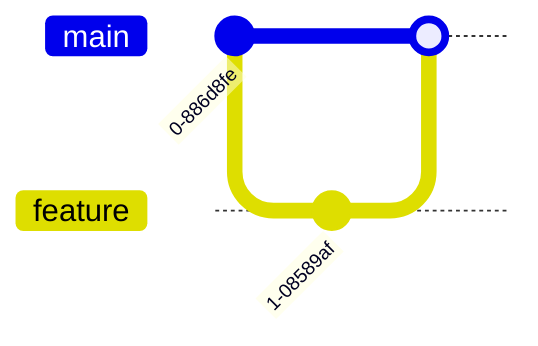
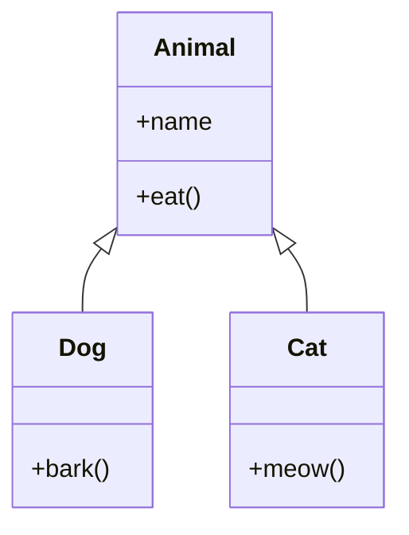

# Markdown Preview Test

A complete markdown preview test file.

---

## Table of Contents

- Introduction
- Headings
- Lists
- Tables
- Code
- Images
- Quotes
- Task Lists
- Mermaid
- HTML

---

# Heading 1

Lorem ipsum dolor sit amet.

## Heading 2

Lorem ipsum dolor sit amet.

### Heading 3

Lorem ipsum dolor sit amet.

#### Heading 4

Lorem ipsum dolor sit amet.

##### Heading 5

Lorem ipsum dolor sit amet.

###### Heading 6

Lorem ipsum dolor sit amet.

---

## Text Formatting

**Bold**

_Italic_

_**Bold + Italic**_

~~Strikethrough~~

`Inline Code`

---

## Lists

### Unordered

- Apple
- Mango
- Orange
  - Child 1
  - Child 2
    - Child 3

### Ordered

1. Install Node
2. Install Next.js
3. Build App

---

## Task List

- [x] React
- [x] Next.js
- [ ] Docker
- [ ] Kubernetes
- [ ] AWS

---

## Blockquote

> This is a quote.
>
> Markdown preview should render this beautifully.

---

## Table

| Name    | Role              | Experience |
| ------- | ----------------- | ---------: |
| Vaibhav | Software Engineer |    2 Years |
| John    | Backend Engineer  |    5 Years |
| Alex    | Designer          |    4 Years |

---

## Image


---

## Horizontal Rule

---

## TypeScript

```ts
interface User {
  id: number;
  name: string;
}

const user: User = {
  id: 1,
  name: "Vaibhav",
};

console.log(user);
```

---

## JavaScript

```javascript
function hello(name) {
  return `Hello ${name}`;
}

console.log(hello("World"));
```

---

## JSON

```json
{
  "name": "Gemlay",
  "version": "1.0.0",
  "private": true
}
```

---

## Bash

```bash
npm install
npm run dev
```

---

## HTML

```html
<div class="container">Hello World</div>
```

---

## CSS

```css
.container {
  display: flex;
  justify-content: center;
  align-items: center;
}
```

---

## SQL

```sql
SELECT *
FROM users
WHERE age > 18;
```

---

## React

```tsx
export default function App() {
  return <div>Hello React</div>;
}
```

---

# Mermaid Flowchart



---

# Mermaid Sequence



---

# Mermaid ER Diagram



---

# Mermaid State



---

# Mermaid Git Graph



---

# Mermaid Class Diagram



---

## HTML Support

<div style="padding:20px;border:1px solid #888;border-radius:8px;">
This HTML should render if HTML is enabled.
</div>

---

## Nested Quote

> Quote Level 1
>
> > Quote Level 2
> >
> > > Quote Level 3

---

## Emoji

🚀 🚀 🚀

🔥

❤️

🎉

---

## Links

[Google](https://google.com)

[GitHub](https://github.com)

---

## Inline HTML

This is <kbd>Ctrl</kbd> + <kbd>C</kbd>

---

# End

Thanks for testing the markdown preview 🎉
