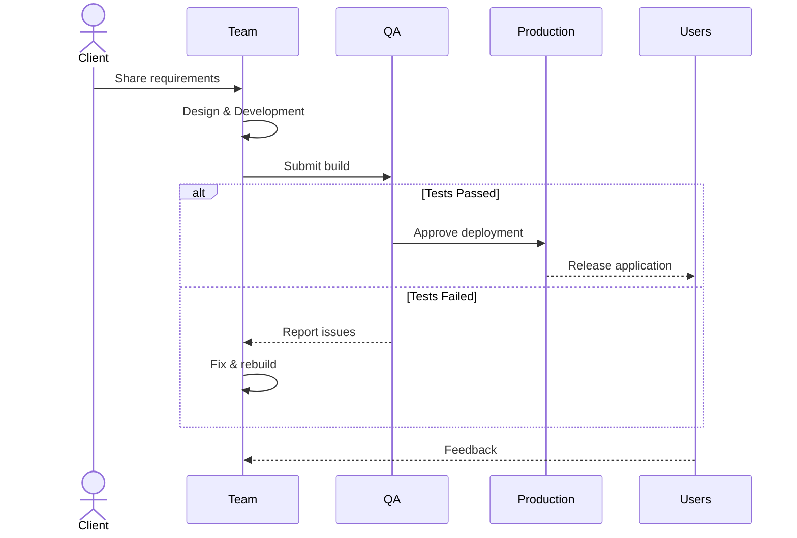

# 🚀 From Idea to Production

> Every successful product follows a structured engineering journey.

```mermaid
sequenceDiagram
    actor Client
    participant Team
    participant QA
    participant Production
    participant Users

    Client->>Team: Share requirements
    Team->>Team: Design & Development
    Team->>QA: Submit build

    alt Tests Passed
        QA->>Production: Approve deployment
        Production-->>Users: Release application
    else Tests Failed
        QA-->>Team: Report issues
        Team->>Team: Fix & rebuild
    end

    Users-->>Team: Feedback
```
